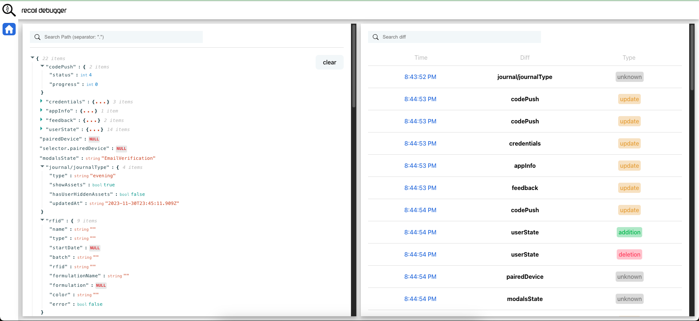

# recoil-debugger

A lightweight recoil debugger



## how to use

1. Install in your project the observer package:

```bash
yarn add recoil-debugger-hook
```

2. Use it under your RecoilRoot call

```js
import DebugObserver from 'recoil-debugger-hook';

// your entrypoint component
const App = () => {
}

export default () => (
  <RecoilRoot>
    <DebugObserver /> // add here
    <App />
  </RecoilRoot>
);
```

3. clone recoil-debugger repository and run:

```bash
yarn && yarn start
```

4. open `localhost:3000` in your browser

## next steps

1. Dockerfile
2. light/dark mode
3. analytics page with graph of atom call per second
4. set atoms states from debugger
5. custom port